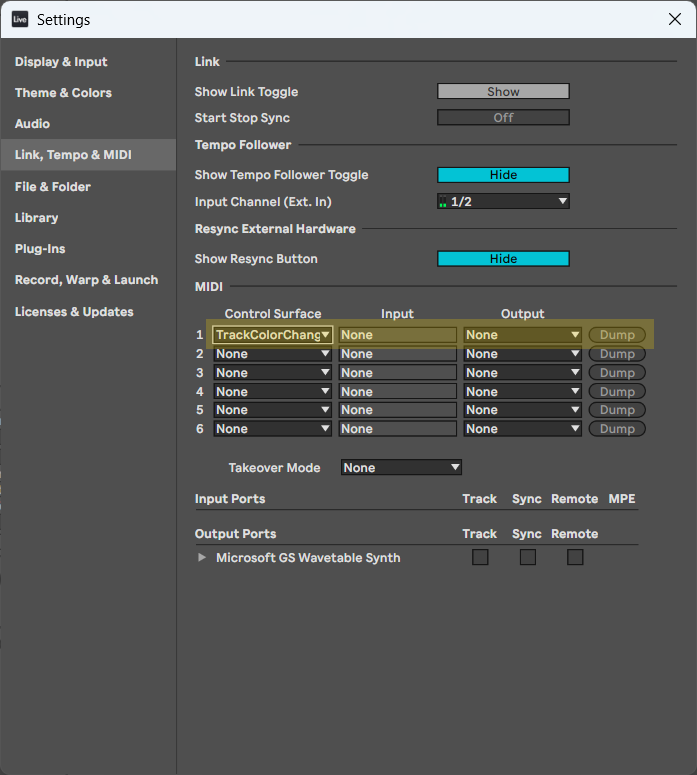
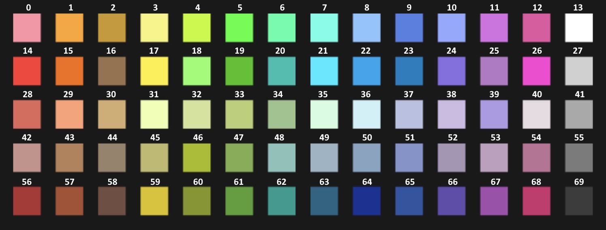
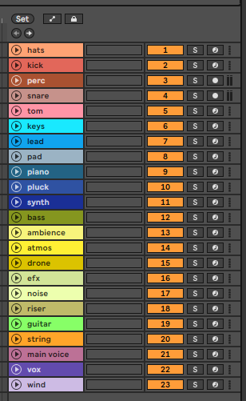
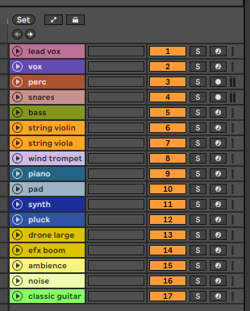

# Ableton Track Color Changer
> **Objective:** Automatic color assignment if it contains the track name In Ableton Live
>
> **Description:** this python program lets you assign a color in an Ableton track depending the name of the track. The color of the tracks help you to organize, find and visualize quickly the tracks in your musical composition
> 
> **Note:** This code is based in the original from [CoryWBoris](https://github.com/CoryWBoris) named [AbletonAutoColor](https://github.com/CoryWBoris/AbletonAutoColor). The code of this repository has been tested on Ableton Live 12


## Why this project
The project from Cory was working fine, but there were two things that I wanted to change.
* The first one related with the colors used by Cory.
* The second one and most important for me, be able to change the color of a track, if the track or some part of it, contains the text that we use to change the color

For example, if my plan is change the color of a track at Ableton if the text is "synth", I would like to change this if the track contains "synth", not if is equal to "synth". So if my track is named as "synth", or "synth main" or "whatever synth", the color change will be applied too


## How it works
> **This project is for Mac and Windows**

- This is a python code, that Ableton is able to interpret and work with it (we'll talk about it later) 
- You will have to download two files, put them into a folder, and open Ableton Live
- After this, you will have to go to the Settings in Ableton Live, and indicates the python code that you want to use
- Restart Ableton Live, and use the utility

When you open Ableton Live, this utility will be working. You can go to the Settings of Ableton Live again, to disable it


## Installation
> The installation is manual but very easy. Follow the next steps:

1) You will have to go to the `User Library` of `Ableton Live`

For **macOS** users: go to `/Users/{your_username}/Music/Ableton/User Library`

For **Windows** users: go to `\Users\[username]\Documents\Ableton\User Library`

2) Create the folder **`Remote Scripts`** if it's not already created
3) Create a folder titled **`TrackColorChanger`** inside the **`Remote Scripts`** folder
4) Download both .py files, **`TrackColorchanger.py`** and **`__init__.py`** that you will find in the folder **`TrackColorChanger`** of this repository, and place them (overwrite the folder if it is necessary) in the **`Remote Scripts/TrackColorChanger`** folder
5) Restart or Open Ableton Live
6) Go to the **`Ableton Live Settings`**, select **`TrackColorChanger`** in the "Link|Tempo|Midi" tab of Ableton Live Settings, and make sure the input and output are set to 'None'




## Organization of the colors
I have organized the name of the tracks by categories, but in the program, you can find the name of the tracks only

I share with you the categories, name of the tracks and color. You can edit this content as you want. I am going to explain you how to do it

**drum**
- "hats": 29
- "kick": 28
- "perc": 57
- "snare": 42
- "tom": 0

**synth**
- "keys": 21
- "lead": 22
- "pad": 49
- "piano": 63
- "pluck": 65
- "synth": 64

**bass**
- "bass": 60

**efx**
- "ambience": 3
- "atmos": 17
- "drone": 59
- "efx": 32
- "noise": 31
- "riser": 45

**strings**
- "guitar": 18
- "string": 1

**vocal**
- "lead vox": 54
- "vox": 66

**wind**
- "wind": 38

This information can be found in the python code:

```py
track_colors = {
    "hats": 29,
    "kick": 28,
    "perc": 57,
    "snare": 42,
    "tom": 0,
    "keys": 21,
    "lead": 22,
    "pad": 49,
    "piano": 63,
    "pluck": 65,
    "synth": 64,
    "bass": 60,
    "ambience": 3,
    "atmos": 17,
    "drone": 59,
    "efx": 32,
    "noise": 31,
    "riser": 45,
    "guitar": 18,
    "string": 1,
    "lead vox": 54,
    "vox": 66,
    "wind": 38
}
```

The code or number of each color, can be found in the next table/image



And the list of this colors in a Ableton Live project, and in all its tracks in the next one:



As I said, you can use the name or part of it in your tracks to give the same color, regardless of using the exact word or a text with the word:



If you want to change a text or color, you can edit the file **`TrackColorchanger.py`**

Remember save the file and restart Ableton Live to apply the changes.
